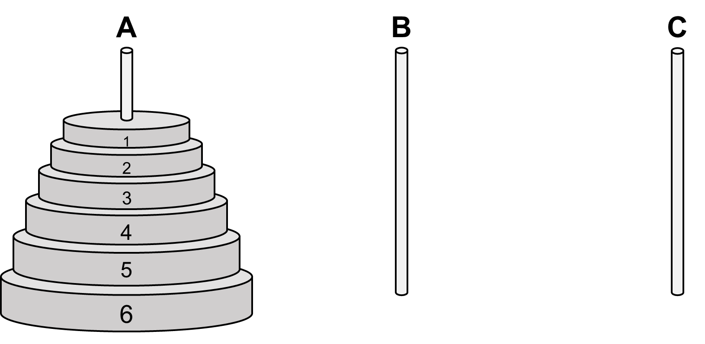

### Inleiding

De Torens van Hanoi is een puzzelspel dat gespeeld wordt met een aantal ronde schijven. Het spel bestaat uit een plankje met daarop drie stokjes. Bij aanvang van het spel is op één van de stokjes een kegelvormige toren geplaatst van ronde schijven met een gat in het midden. De schijven hebben verschillende diameters. Ze zijn zo geplaatst dat er geen grotere schijf op een kleinere schijf ligt.

Het doel van het spel is om de complete toren van schijven te verplaatsen naar een ander stokje. Daarbij moeten de volgende regels in acht genomen worden:

* Er mag slechts 1 schijf tegelijk worden verplaatst.
* Er mag nooit een grotere schijf op een kleinere liggen.

{:width="20%"}

Misschien helpt het om het spel een paar keer [online](https://nl.goobix.com/online-spelletjes/torens-van-hanoi/#) te spelen met verschillende waarden van `n`.

### Opgave

Schrijf een functie `Hanoi(n)` die op een recursieve manier berekent hoeveel stappen er nodig zijn om om een toren van `n` schijven te verplaatsen. 

Test je code in Dodona. Let daarbij op dat je geen hoofdprogramma ingeeft.

### Voorbeeld

**Invoer:**

    > hanoi(5)

**Uitvoer:**

    31